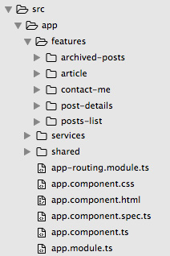

## Cosmétique

**L'important dans un blog, c'est le contenu** ... mais il n'empêche que si les articles sont agréables à lire, c'est quand même mieux ! Ben oui, désolé [Martin](https://martinfowler.com/), ton blog est génial mais il pique un peu les yeux :-p La première étape pour créer mon blog a donc été de lui trouver un visuel sexy.

Je ne suis pas graphiste, inutile donc de tenter quoi que ce soit dans ce domaine. D'autant que la création de pages en html a énormément évolué ces dernières années : [HTML5](https://www.html5rocks.com/), [CSS3](http://gafish.fr/nouveautes-css3/), _[responsive design](https://www.alsacreations.com/article/lire/1615-cest-quoi-le-responsive-web-design.html)_, ... on est à des années lumière des débuts d'Internet avec ses pages complètement statiques, ses _layouts_ en taille fixe, ses scripts js qui prennent 100% du cpu pour faire tomber 10 malheureux flocons (même si en 2017 [les flocons sont toujours là :-p](https://hcodes.github.io/snowflakes/index.html)). **Pour ce qui est de l'habillage, j'ai donc sous-traité** ;-)

Des templates html, il y en a plein sur le net, mais il sont soit payants, soit moches. Et beaucoup ne fournissent qu'un simple squelette de page. J'ai cherché de longues soirées d'hiver mais j'ai fini par dénicher quelques candidats. Après quelques essais, j'ai opté pour [Sparrow](http://www.styleshout.com/demo/?theme=sparrow). En plus de fournir un ensemble de pages de toutes sortes (landing page, portfolio, blog, ...), il propose une typographie, une mise en page, des composants graphiques (pagination) ... et pour ne rien gâcher, il est gratuit ;-). Il ne manque qu'une page d'erreur (pour les 404 par exemple) mais ça c'est dans mes compétences.

## Le découpage

Angular 2 s'inspire très largement des [Web Components](http://blog.soat.fr/2015/02/html-5-introduction-aux-web-components/) même s'il n'est pas compatible avec pour le moment. Ainsi, **les composants Angular représentent des unités autonomes, qui embarquent leur template html, leur style css et leur logique métier**. Je n'ai donc pas intégré mon code dans mon template, j'ai plutôt découpé mon template pour l'intégrer dans mon code !

Pour faire un découpage propre, j'ai reposé à plat les concepts fondamentaux d'un blog : des articles classés par catégorie, des mots-clés pour la recherche et les rapprochements, des métas-données (auteur, date de publication, résumé). Tous ces éléments m'ont donné les différents morceaux du puzzle :

1. un composant « article » qui affiche soit le résumé d'un article, soit un article complet en fonction du contexte; il affiche les méta-données (catégorie, tags, ...) et le contenu de l'article
1. un composant « liste d'articles », qui gère les différents points d'entrée (par date de publication, par catégorie, ...); il utilise des instances du composant « article » 
1. un composant « archive » pour afficher les vieux trucs; il utilise lui-aussi le composant « article » (j'aurais presque pu le fusionner avec le composant de gestion des listes ...)
1. un composant « contact » pour que les lecteurs puissent prendre contact avec moi (pour ceux qui le cherchent, il n'est pas encore déployé)
1. et un composant « application » qui encapsule et pilote tout ce petit monde

Au final ça donne :



Et le fichier d'index se résume aux métas habituels et aux styles css :

```html
<!DOCTYPE html>
<html class="no-js" lang="fr">
<head>

	<base href="/" />

	<!-- meta, title, favicon, css  -->

</head>
<body>
   <app-root>Chargement en cours ...</app-root>
</body>
</html>
```

Le découpage en composants est très important : la granularité doit être bien réfléchie pour permettre de réutiliser facilement les "morceaux" obtenus.

Pour ce projet somme toutes assez simple, je n'ai pas beaucoup d'interactions entre les composants, tout au plus quelques [@Input](http://learnangular2.com/inputs/) pour passer les infos. Dans un projet plus conséquent, où les composants doivent dialoguer entre eux, il faudra veiller à ce que les composants soient bien cloisonnés, et que leur interface de communication avec le monde extérieur soit bien définie et/ou documentée. Le [cookbook angular](https://angular.io/docs/ts/latest/cookbook/component-communication.html) est un bon début pour savoir comment faire, mais c'est l'expérimentation qui vous montrera la voie ;-). 


Dans le prochain billet, on parlera du stockage des articles. A très vite !
