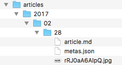

Il y a quelques mois, j'ai lu un article hyper intéressant sur les formats de fichiers. J'ai malheureusement égaré le lien mais pour vous la faire courte, l'auteur y explique que **le seul format atemporel est le texte brut** : dans 10 ans, on pourra toujours lire un fichier texte et si besoin, écrire un programme pour en extraire les données. **Peut-on dire de même pour tous les formats ?** même les plus universels comme le jpg ou le pdf ? Pas sûr, quand on apprend que [Fraunhofer met fin au programme de license du mp3](http://www.numerama.com/tech/257967-le-mp3-est-mort-mais-vous-pouvez-toujours-en-ecouter.html), le format musical développé dans les années 80 sûrement le plus répandu dans le monde.

Cette lecture a été le déclencheur d'une (mini) révolution intellectuelle : c'en est fini de l'hégémonie des bases de données relationnelles ! Les articles et les pages de mon blog, mais également toutes les *méta-données* seront sérialisés dans des fichiers ! Et si tout est fichier, pas besoin de [backend](https://www.alticreation.com/difference-developpeur-front-end-et-developpeur-back-end/). **Mon blog sera donc (presque) entièrement statique** \0/.

### Les articles 

Les blogs permettent le plus souvent d'écrire les articles et autres contenus en *wysiwyg* : un éditeur permet de mettre en forme le texte comme on le ferait dans un traitement de texte. Le contenu ainsi mis en forme est généralement **transformé en code html prêt à l'emploi**, stocké tel quel en base de données. Ce mode de fonctionnement est agréable pour le rédacteur, assez performant puisque le contenu est déjà au bon format pour le web mais pas facilement réutilisable. Le code html produit est parfois un peu touffu donc peu «&nbsp;performant&nbsp;», les liens hypertexte sont figés, le contenu est dilué entre les balises html, ... bref, ca ne me convient pas.

Pour commencer, **je me suis donc penché sur la question du format d'écriture**. J'ai cherché dans les formats textuels ceux qui étaient simples à écrire, à transformer, à réutiliser : bbcode, wiki, [markdown](https://daringfireball.net/projects/markdown/syntax), ... et c'est ce dernier que j'ai choisi. Pour sa popularité croissante d'abord : c'est le langage de github et d'angular ;-) . Pour son « intuitivité » ensuite : la syntaxe est très facile à appréhender. Et pour compléter le tout, il existe pléthore de librairies pour le *parser* et surtout le transformer en html (ou autre si besoin).

Mon site s'exécutant exclusivement dans le navigateur du visiteur, je me suis mis en chasse d'un composant, si possible compatible angular 2, pour effectuer la transformation markdown -&gt; html. Mon choix s'est d'abord porté sur [angular2-markdown](https://github.com/dimpu/angular2-markdown) qui, comme sont nom l'indique, fait le job. Mais en essayant de le customiser, je me suis aperçu que le code n'était pas assez ... comment dire ... assez adaptable. J'ai donc tout réécrit, et j'ai ainsi pu personnaliser le rendu à ma guise en reconfigurant le *parser* utilisé. Pour les images, j'ai par exemple géré les url relatives en surchargeant le renderer adéquat:

```js

    this.renderer = new marked.Renderer();

    this.renderer.image = function (href, title, text) {
      let absoluteUrl = new RegExp('^(?:[a-z]+:)?//', 'i');
      // /!\ "this" is the renderer, not the angular component
      if(thiz.baseUrl != null) {
        if(absoluteUrl.test(href) === false) {
          href = thiz.baseUrl + href;
        }
      }
      // call initial implementation
      return marked.Renderer.prototype.image.call(this, href, title, text);
    }

```

Les blogs sont par nature chronologiques : les articles sont affichés du plus récent au plus vieux, il faut alors pouvoir les trier facilement et rapidement. Pour le stockage des fichiers, **j'ai donc opté pour une structure arborescente** assez simple : un répertoire racine, contenant un sous-répertoire par année, puis un sous-répertoire par mois puis un par jour. Point positif de cette organisation, le tri des noms de répertoire suffit à ordonner les articles ; point négatif, la date de publication est figée dans l'aborescence ... c'est gênant en phase d'écriture puisqu'on on doit déterminer la date de publication à l'avance sous peine de devoir renommer les répertoires au fur et à mesure, mais une fois qu'un article est publié, sa date de mise en ligne ne bougera plus. Et pour finir, au plus bas de l'arborescence se trouve un fichier `article.md` contenant le billet.

Au final, ça ressemble à ça :



Cette organisation impose une limitation d'un article par jour maximum ... mais c'est laaaargment suffisant pour mes besoins ;-).

### Les méta-données

#### Structure

Pour faire fonctionner un blog, il faut des articles mais pas que. Il faut également stocker des *méta-données*, c'est-à-dire les données à propos des données : une liste de catégories pour classer les billets, des mots-clés (*tags*), les dates de publication, ... bref, **tout ce qui gravite autour des articles**. Ces infos permettent d'organiser la présentation du blog, et de naviguer entre les articles. Ce sont des données structurées, il faut donc un peu plus que du texte brut pour les persister, et comme elles seront interpretées côté client en Javascript, je ne me suis même pas posé la question du format, ca sera du [json](http://json.org). 

Chaque article a ainsi son fichier associé `metas.json`, contenant toutes ses infos de publication :

```json
{
   "published": "2017-02-28T18:51:34Z",
   "title": "A brand new blog !",
   "excerpt": "Mi-2015, j'ai choisi de résilier ... ",
   "image": "rRJ0aA6AIpQ",
   "category": null,
   "tags": ["hello world"]
}
```
Au niveau de contenu, on y trouve la date et l'heure de publication (la partie date doit correspondre à l'arborescence de stockage), le titre de l'article et le résumé (le « tl;dr » juste en dessous de l'image), l'image qui habille le haut du billet, la catégorie et les tags éventuels. En ce qui concerne l'image, j'ai abusé de [CoC](https://fr.wikipedia.org/wiki/Convention_plutôt_que_configuration) : la valeur est l'identifiant de l'image sur [Unsplash](http://unsplash.com), ce qui me permet de reconstruire le lien complet vers l'image d'origine pour créditer l'auteur, et c'est aussi le nom de l'image sur mon serveur (en jpg).

Pour faciliter leur récupération, et éviter d'avoir à faire des dizaines de requêtes http, j'ai utilisé un principe énormément utilisé en [NoSql](https://fr.wikipedia.org/wiki/NoSQL), la dénormalisation (i.e. dupliquer la donnée). J'ai ainsi fait des agrégats de ces fichiers par catégories, par tags et par années pour les archives. Alors oui, ca fait beaucoup de fichiers mais c'est le prix à payer pour renoncer au relationnel. Leur taille reste raisonnable, et si elle augment de trop, j'ai prévu de gérer une pagination en éclatant les fichiers par blocs de n articles.

#### Maintenance

Alors tous ces fichiers d'index, c'est bien beau, mais il faut les faire vivre au rythme des publications. A chaque nouvel article, il faut mettre à jour les catégories, les tags, les archives ... Comme je suis ~~paresseux~~ développeur, j'ai automatisé tout ça ;-). Je suis sur un hébérgement mutualisé, donc les possibilités de scripting sont restreintes : bash, perl, python ... Le python, c'est pas mal mais j'ai jamais réussi à m'y mettre. Perl n'en parlons pas, reste le bash mais pour manipuler du json, pas terrible. C'est là que [jq](https://stedolan.github.io/jq/) entre en scène : jq est un *command-line json processor*. Il consomme du json, le retravaille, le réorganise, le restructure et le recrache, en json ou en autre chose. Problème, cet utilitaire ésotérique n'est évidemment pas mis à disposition par mon hébérgeur ... qu'à celà ne tienne ! jq est tellement bien pensé qu'il est écrit **en C sans dépendance sur une quelconque librairie** ! Et il est déjà précompilé en 64 bits pour linux \0/. Un transfert FTP plus tard, jq est sur mon espace web. Piloté par un shell script (assez cossu j'admets), il me permet de reconstituer mes « bases de données statiques » en json.

Voici par exemple le bout de code bash qui index les tags

```bash
files=()

# pour chaque tag
for tag in "${tags[@]}"; do

    # pour chaque fichier d'index
    for f in $(ls -d */*/*/metas.json 2> /dev/null | sort -nr); do

		# l'article est-il rattaché au tag courant ?
		match=$( ./jq --raw-output --arg tag "$tag" '.tags[] | select(. == $tag)'  "$f" )
		
		# si on a une correspondance, c'est que
		# l'article contient le tag courant
		[ -z "$match" ] || files+=("$f")

    done

    temp=$(kebab_case "$tag")
    json_concat "tags/$temp.json" "${files[@]}"

done

```

Et pour finir, comme tout blog qui se respecte, j'ai également [un flux rss](http://dmbb.fr/articles/feed.xml) généré lui-aussi grâce à jq. Alors oui, ça pique un peu les yeux mais ça donne une bonne idée du potentiel énorme de cet outil :

```bash
.[] |
"<item>",
  @html "<title>\(.title)</title>",
  @html "<link>http://www.dmbb.fr/published/\(.published[0:10] | split("-") | join("/"))</link>",
  @html "<guid isPermaLink=\"true\">http://www.dmbb.fr/published/\(.published[0:10] | split("-") | join("/"))</guid>",
        "<description><![CDATA[\(.excerpt)]]></description>",
  @html "<pubDate>\( .published | fromdateiso8601 | strftime("%a, %d %b %Y %k:%M:%S %z") )</pubDate>",
  @html "<category>\( .category // empty )</category>",
"</item>"
```

### Conclusion

Alors oui, c'est encore pas mal artisanal, et c'est moins *user-friendly* qu'un clic sur un bouton « Publier », mais c'est ce que je recherchais. Et un blog statique présente tout de même de sérieux avantages : la performance d'abord, mais j'y reviendrai en détail lors du prochain article de la série, mais également la sécurité. L'absence de backend réduit drastiquement la surface d'attaque du site. Je ne suis d'ailleurs [pas à avoir choisi cette voie](https://thehackerblog.com/the-unhackable-wordpress-blog-finding-security-in-the-static/index.html) ;-)

La prochaine fois, je détaillerai toutes les optimisations que j'ai mises en place pour sauver quelques ours polaires. Stay tuned !
