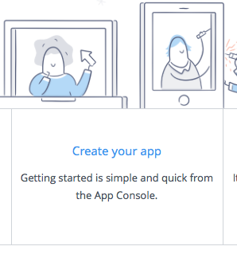
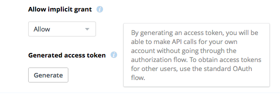

## Utiliser dropbox comme moyen de stockage

Avant de commencer, il faut bien comprendre comment fonctionne le service DropBox. Ce n'est pas un hébergeur de fichiers classique comme pourrait l'être [Firebase](http://firebase.com). Une DropBox (oui, moi je dis une :-p) est liée à un son propriétaire, et l'api ne fait qu'accéder à la dropbox de cet utilisateur. Il est donc inopportun d'utiliser le service comme stockage pour une application 

## Créer son application

Avant de pouvoir utiliser l'api dropbox, il faut créer une application. C'est gratuit et n'engage à rien tant que vous n'avez pas pas plus de 49 clients. Au delà de cette limite, il faudra demander à passer en production. Je vous en dirais bien plus à ce sujet mais je n'en suis pas encore arrivé là ;-)

Rendez-vous dans la section [développeur](https://www.dropbox.com/developers) de DropBox et créez une application. Donnez-lui un nom et indiquez si l'application doit accéder à tout le contenu de la DropBox ou si elle sera cloisonnée à un sous-répertoire du répertoire « Applications » (à la racine).



Pour un usage limité (moins de 50 clients), le mode développement peut _à priori_ servir pour la production.

## Intégrer l'api

Sur ce point, dropbox a bien fait les choses : leur api est un module npm \0/. Pour l'intégrer à votre projet Angular, il suffit de le déclarer en dépendance :-)

```
$ npm install --save dropbox
```

## Utiliser l'api

Tous les appels à l'api doivent contenir un jeton [OAuth2](https://oauth.net/2/) permettant d'identifier l'utilisateur et donc sa dropbox. Je ne vais pas m'étendre ici sur le sujet (assez vaste et quelque peu complexe). Pour vos développement, l'interface de configuration de l'application permet d'en générer un "en dur".



L'importation de la librairie se fait via une directive require (j'ai pas réussi à faire fonctionner l'import) :
```js
var Dropbox : any = require('dropbox');
```
Inconvénient, [il manque le typage](https://github.com/dropbox/dropbox-sdk-js/issues/65) et donc l'autocomplétion lors de l'écriture du code :'( Mais avec la doc sous les yeux, ça ne pose pas vraiment soucis. Après tout, on faisait comment dans les années 90 pour développer en C sous vi ? Bon moi j'ai pas connu cette époque mais on m'a raconté :-p

Voilà un exemple pour lister le contenu du répertoire de l'application (ou la racine de la DropBox si l'application a accès à tout son contenu) :

```js
// initialisation de la lib avec le jeton OAuth2
this.dbx = new Dropbox({ accessToken: 'J...A' });
this.dbx.filesListFolder({path: ''})
	.then(function(response) {
	    if(response.entries.length > 0) {
	    	for(let entry of response.entries) {
	    		console.log(entry);
	      }
	    }
	})
	.catch(function(error) {
		alert('Impossible de récupérer la liste des fichiers (' + error.error + ')');
	});  
```
Toutes les méthodes renvoient des [promise](https://developer.mozilla.org/fr/docs/Web/JavaScript/Reference/Objets_globaux/Promise). Les types de retour sont très bien décrits dans la doc, il faut juste comprendre qu'une métode peut renvoyer plusieurs types de résultats, génralement différenciés par la propriété `.tag`.

La suite, c'est à vous de l'écrire ;-)
