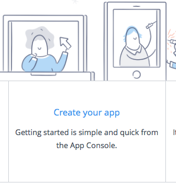
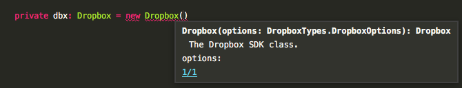
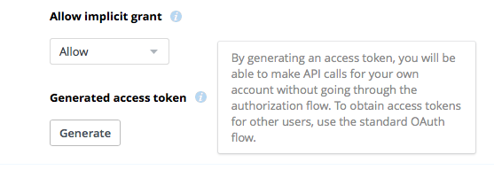

## Utiliser Dropbox comme moyen de stockage

Utilisant IndexedDB en local, il aurait été logique de choisir également une base de données en ligne pour effectuer une réplication distante des données. [Certaines librairies](https://pouchdb.com) permettent même de faire ça de manière automatique. Mais quand tout se fait tout seul, c'est moins fun ;-) J'ai donc choisi de faire de la synchro par fichiers via ma DropBox (oui, DropBox est féminin :-p). Il existe en effet [une API](https://www.dropbox.com/developers) officielle implémentée dans tout un tas de langages permettant de piloter sa DropBox depuis une application tierce.

## Créer son application

Avant de pouvoir utiliser l'API, il faut en informer Dropbox. C'est gratuit et n'engage à rien tant que vous n'avez pas pas plus de 49 clients. Au delà de cette limite, il faudra demander à « passer en production ». Je vous en dirais bien plus à ce sujet mais je n'en suis pas encore arrivé là ;-)

Rendez vous dans la section [développeur](https://www.dropbox.com/developers) de DropBox et choisissez « Create your app ». Donnez un nom et indiquez si l'application doit accéder à tout le contenu de la DropBox ou si elle sera cloisonnée à un sous-répertoire du répertoire `Applications` (automatiquement créé à la racine).



De ce que j'en ai vu jusqu'à maintenant, le mode développement peut _à priori_ servir pour la production tant que vous ne dépassez pas la limite de client.

## Intégrer l'api

Intégrer l'api dans un projet Angular ne pose pas de difficultés une fois qu'on sait comment faire :-p. Première étape, installer le paquet npm (avec npm 5, [plus besoin d'ajouter `--save`](http://blog.npmjs.org/post/161081169345/v500) puisque c'est l'option par défaut):

```bash
$ npm install --save dropbox
```

Ensuite, il faut importer le module dans le projet. Première tentative :

```js
import { Dropbox } from 'dropbox';
```

Crack ! Le compilateur me crie dessus : « Module '…/dropbox/src/index' resolves to a non-module entity and cannot be imported using this construct ». Ca risque d'être un peu plus compliqué que prévu. Quelques Stack Overflow plus tard, j'ai une deuxième piste :

```js
var Dropbox : any = require('dropbox');
```

Pas d'erreur à la compilation, et l'appel aux fonctions se fait bien mais pas d'auto-complétion lors de l'écriture du code :-@ Il est vrai que quand j'ai commencé à développé dans les années 90, on n'avait de toute façon pas d'auto-complétion et on arrivait quand même à faire tourner du code ... mais on s'habitue vite au luxe. Après quelques recherches, j'ai trouvé ce qui n'allait pas : 1) ma déclaration était inadéquate, et 2) il me manquait [le typage](https://github.com/typings/typings).

### Mieux intégrer l'api

Dans les premières versions de TypeScript (avant la 1.5), la notion de module javascript n'avait pas encore été définie. TypeScript a donc proposé son propre mécanisme d'import avec la syntaxe `import <class_definition> = require('');`. Arriva l'ES6 qui introduisait la notion de module et d'[import](https://developer.mozilla.org/fr/docs/Web/JavaScript/Reference/Instructions/import) : TypeScript s'est alors mis à la nouvelle norme pour intégrer la syntaxe que l'on connaît bien.

Pour en revenir à nos moutons, l'api Dropbox n'est pas (encore?) au format ES6, il faut donc l'importer avec l'ancienne syntaxe.

```js
import Dropbox = require('dropbox');
```

Et du coup, j'ai la completion de code sans rien faire de plus \0/



Mais comme en informatique rien n'est magique, il y a une explication rationnelle. Pour ceux que ça n'intéresse vraiment pas, je leur propose de sauter le paragraphe suivant ;-)

### Completion de code

TypeScript étant typé statiquement, un IDE peut facilement a proposer l'auto-completion. Par contre, comment peut-il faire pour une librairie écrite nativement en javascript ? Il faut alors lui dire quels objets, et quels méthodes sont disponibles. C'est l'objectif des définitions de type. Ce sont des fichiers typescript, en général avec l'extension `.d.ts` ou javascript, souvent nommés `types.js`.

Extrait du fichier index.d.ts pour le module `node` :

```typescript

// This needs to be global to avoid TS2403 in case lib.dom.d.ts is present in the same build
interface Console {
    Console: typeof NodeJS.Console;
    assert(value: any, message?: string, ...optionalParams: any[]): void;
    dir(obj: any, options?: NodeJS.InspectOptions): void;
    error(message?: any, ...optionalParams: any[]): void;
    info(message?: any, ...optionalParams: any[]): void;
    log(message?: any, ...optionalParams: any[]): void;
    time(label: string): void;
    timeEnd(label: string): void;
    trace(message?: any, ...optionalParams: any[]): void;
    warn(message?: any, ...optionalParams: any[]): void;
}

interface Error {
    stack?: string;
}

... 
```

En TypeScript 1.x, les types étaient gérés avec un utilitaire en ligne de commande : [typings](https://github.com/typings/typings). A partir de la version 2.x, les types ont été [incorporés directement dans npm](https://github.com/DefinitelyTyped/DefinitelyTyped), sous le namespace `@types`. Ajouter une définition pour jQuery par exemple revient à exécuter la commande `npm install @types/jquery`.

A l'heure actuelle, le nombre de définitions est limité mais [il grossi de jours en jours](https://www.npmjs.com/search?q=%40types).

En ce qui nous concerne, les types pour l'api Dropbox ne sont pas encore dispo dans le repo npm mais sont [depuis peu](https://github.com/dropbox/dropbox-sdk-js/issues/65) diffusés avec le module. Le fichier de type ne contient pas de définition d'interfaces, juste une pseudo-javadoc, mais ça semble suffisant, pour Sublime Text en tout cas.

## Utiliser l'api

Tous les appels à l'api doivent contenir un jeton [OAuth2](https://oauth.net/2/) permettant d'identifier l'utilisateur et donc sa dropbox. Je ne vais pas m'étendre ici sur le sujet (assez vaste et quelque peu complexe). Pour vos développement, l'interface de configuration de l'application permet d'en générer un "en dur".



Maintenant que tout est prêt, il reste à écrire un peu de code.  Voilà un exemple pour lister le contenu du répertoire de l'application (ou la racine de la DropBox si l'application a accès à tout son contenu) :

```js
// initialisation de la lib avec le jeton OAuth2
this.dbx = new Dropbox({ accessToken: 'J...A' });
this.dbx.filesListFolder({path: ''})
    .then(function(response) {
        if(response.entries.length > 0) {
            for(let entry of response.entries) {
                console.log(entry);
          }
        }
    })
    .catch(function(error) {
        alert('Impossible de récupérer la liste des fichiers (' + error.error + ')');
    });  
```
Toutes les méthodes renvoient des [promise](https://developer.mozilla.org/fr/docs/Web/JavaScript/Reference/Objets_globaux/Promise). Les types de retour sont très bien décrits dans la doc, il faut juste comprendre qu'une métode peut renvoyer plusieurs types de résultats, génralement différenciés par la propriété `.tag`.

## What next ?

La suite, c'est à vous de l'écrire ;-)
