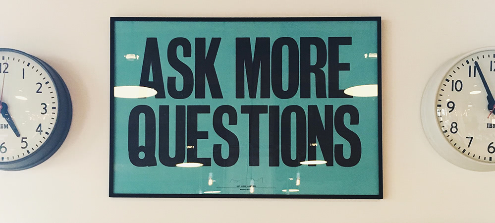

#### Pourquoi ce nom de domaine ?

Parce que je travaille dans un grand bureau tout blanc ... mais qu'il y règne un [bleu](https://fr.wikipedia.org/wiki/Modèle_Herrmann) harmonieux :-p

#### Pourquoi un blog fait maison ?

Parce que Wordpress c'est trop, trop ... trop quoi !

#### Pourquoi je peux pas faire de commentaires ?

Parce que je n'ai pas encore écrit le code qui permet de le faire ;-)

#### Pourquoi y'a pas d'emojis dans tes textes ?

Parce que je préfère les smileys en ascii art .

#### Pourquoi ça marche pô (ou très mal) sous IE ?

Parce que si ce blog t'intéresse, c'est que tu ne bosses pas avec IE :-p

#### Pourquoi je peux pas te contacter ? 

Pareil que pour les commentaires. Mais tu peux m'envoyer un mail : si c'est pour une critique positive, c'est [ici](mailto:contact@dmbb.fr), sinon c'est [là](mailto:nulle-part@ailleurs.fr) :-p.